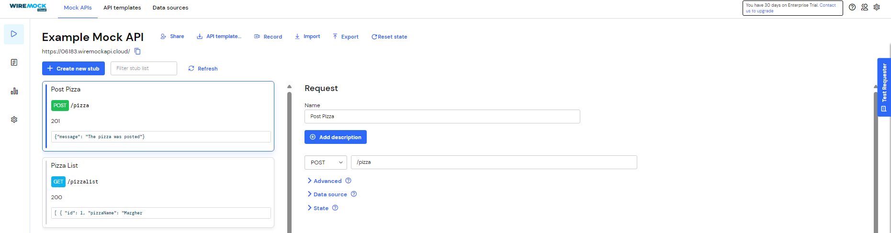

# Nama  : Lukman Eka Septiawan
# Kelas : TI-3C

# Praktikum 1, Designing an HTTP client and getting data 
> Sebagian besar aplikasi seluler mengandalkan data yang berasal dari sumber eksternal. Pikirkan aplikasi untuk membaca buku, menonton film, berbagi gambar dengan teman, membaca berita, atau menulis email: semua aplikasi ini menggunakan data yang diambil dari sumber eksternal. Ketika sebuah aplikasi menggunakan data eksternal, biasanya, ada layanan backend yang menyediakan data tersebut untuk aplikasi: layanan web atau API web. Yang terjadi adalah aplikasi Anda (frontend atau klien) terhubung ke layanan web melalui HTTP dan meminta sejumlah data. Layanan backend kemudian merespons dengan mengirimkan data ke aplikasi, biasanya dalam format JSON atau XML. Untuk praktikum kali ini, kita akan membuat aplikasi yang membaca dan menulis data dari layanan web. Karena membuat API web berada di luar cakupan buku ini, kita akan menggunakan layanan yang tersedia, yang disebut Wire Mock Cloud, yang akan mensimulasikan perilaku layanan web yang sebenarnya, tetapi akan sangat mudah disiapkan dan digunakan.  
## 1. Mendaftarlah ke layanan Lab Mock di https://app.wiremock.cloud/. Bisa anda gunakan akun google untuk mendaftar. Jika berhasil bendaftar dan login, akan muncul seperti gambar berikut. 


## 2. Di halaman dahsboard, klik menu Stubs, kemudian klik entri pertama yaitu “GET a JSON resource”. Anda akan melihat layar yang mirip dengan berikut.


## 3. Klik “Create new stub”. Di kolom sebelah kanan, lengkapi data berikut. Namanya adalah “Pizza List”, kemudian pilih GET dan isi dengan “/pizzalist”. Kemudian, pada bagian Response, untuk status 200, kemudian pada Body pilih JSON sebagai formatnya dan isi konten JSON dari https://bit.ly/pizzalist. Perhatikan gambar berikut. 


## 4. Tekan tombol SAVE di bagian bawah halaman untuk menyimpan Mock ini. Jika berhasil tersimpan, maka Mock API sudah siap digunakan. 

> Mock berhasil disimpan


## 5. Buatlah project flutter baru dengan nama pizza_api_nama_anda, tambahkan depedensi “http” melalui terminal. 

> Project baru


> Penambahan depedensi http


## 6. DI folder “lib” project anda, tambahkan file dengan nama “httphelper.dart”. 


## 7. Isi httphelper.dart dengan kode berikut. Ubah “02z2g.mocklab.io” dengan URL Mock API anda. 

```dart
import 'dart:io';
import 'package:http/http.dart' as http;
import 'dart:convert';
import 'pizza.dart';

class HttpHelper {
  final String authority = '02z2g.mocklab.io';
  final String path = '/pizzalist';
  
  Future<List<Pizza>> getPizzaList() async {
    final Uri url = Uri.https(authority, path);
    final http.Response result = await http.get(url);
    if (result.statusCode == HttpStatus.ok) {
      final jsonResponse = json.decode(result.body);
      List<Pizza> pizzas = jsonResponse.map<Pizza>((i) => Pizza.fromJson(i)).toList();
      return pizzas;
    } else {
      return [];
    }
  }
}
```

## 8. Di file “main.dart”, di class _ MyHomePageState, tambahkan metode bernama “callPizzas”. Metode ini mengembalikan sebuah Future dari daftar objek Pizza dengan memanggil metode getPizzaList dari kelas HttpHelper, dengan kode sebagai berikut: 

```dart
Future<List<Pizza>> callPizzas() async {
    HttpHelper httpHelper = HttpHelper();
    List<Pizza> pizzas = await httpHelper.getPizzaList();
    return pizzas;
}
```

## 9. Pada metode build di class _MyHomePageState, di dalam body Scaffold, tambahkan FutureBuilder yang membuat ListView dari widget ListTile yang berisi objek Pizza:

```dart
Widget build(BuildContext context) {
    return Scaffold(
      appBar: AppBar(
        title: const Text('JSON'),
      ),
      body: FutureBuilder(
        future: callPizzas(),
        builder: (BuildContext context, AsyncSnapshot<List<Pizza>> snapshot) {
          if (snapshot.hasError) {
            print('Error snapshot: ${snapshot.error}');
            return const Text('Something went wrong');
          }
          if (!snapshot.hasData) {
            print('data ${snapshot.data}');
            return const CircularProgressIndicator();
          }
          return ListView.builder(
            itemCount: (snapshot.data == null) ? 0 : snapshot.data!.length,
            itemBuilder: (BuildContext context, int position) {
              return ListTile(
                title: Text(snapshot.data![position].pizzaName),
                subtitle: Text(snapshot.data![position].description + ' - € ' + snapshot.data![position].price.toString()),
              );
            }
          );
        },
      ),
    );
}
```

## 10. Jalankan aplikasi. Anda akan melihat layar yang mirip dengan berikut ini: 


# Praktikum 2. POST-ing data 
> Dalam praktikum ini, Anda akan mempelajari cara melakukan tindakan POST pada layanan web. Hal ini berguna ketika Anda menyambungkan ke layanan web yang tidak hanya menyediakan data, tetapi juga memungkinkan Anda untuk mengubah informasi yang tersimpan di sisi server. Biasanya, Anda harus menyediakan beberapa bentuk autentikasi ke layanan, tetapi untuk praktikum ini, karena kita menggunakan layanan Mock API, hal ini tidak diperlukan. 

## 1. Masuk ke layanan Lab Mock di https://app.wiremock.cloud/ dan klik bagian Stubs, kemudian, buatlah stub baru. 


## 2. Lengkapi isian seperti gambar berikut: 


## 3. Simpan. 



## 4. Di proyek Flutter, di file httpHelper.dart, di kelas HttpHelper, buat metode baru bernama postPizza, lengkapi kode sebagai berikut. 

```dart
Future<String> postPizza(Pizza pizza) async {
  const postPath = '/pizza';
  String post = json.encode(pizza.toJson());
  Uri url = Uri.https(authority, postPath);
  http.Response result = await http.post(url, body: post);
  return result.body;
}
```

## 5. Di dalam proyek, buat sebuah file baru bernama pizza_detail.dart. 


## 6. Di bagian atas file baru, tambahkan impor yang diperlukan. 

```dart
import 'package:flutter/material.dart';
import 'pizza.dart';
import 'httphelper.dart';
```

## 7. Buat StatefulWidget bernama PizzaDetailScreen. 

```dart
import 'package:flutter/material.dart';
import 'pizza.dart';
import 'httphelper.dart';

class PizzaDetailScreen extends StatefulWidget {
  const PizzaDetailScreen({super.key});

  @override
  State<PizzaDetailScreen> createState() => _PizzaDetailScreenState();
}

class _PizzaDetailScreenState extends State<PizzaDetailScreen> {
  @override
  Widget build(BuildContext context) {
    return Placeholder();
  }
}
```

## 8. Di bagian atas kelas _PizzaDetailScreenState, tambahkan lima widget TextEditingController. Widget ini akan berisi data untuk objek Pizza yang akan diposting nanti. Juga, tambahkan sebuah String yang akan berisi hasil dari permintaan POST. 

```dart
class _PizzaDetailScreenState extends State<PizzaDetailScreen> 
  final TextEditingController txtId = TextEditingController();
  final TextEditingController txtName = TextEditingController();
  final TextEditingController txtDescription = TextEditingController();
  final TextEditingController txtPrice = TextEditingController();
  final TextEditingController txtImageUrl = TextEditingController();
  String operationResult = '';
```

## 9. Override metode dispose() untuk membuang controllers 

```dart
@override
void dispose() {
  txtId.dispose();
  txtName.dispose();
  txtDescription.dispose();
  txtPrice.dispose();
  txtImageUrl.dispose();
  super.dispose();
}
```

## 10. Dalam metode build() pada kelas, kita return sebuah Scaffold, yang AppBar-nya berisi Teks yang menyatakan “Detail Pizza” dan Body-nya berisi Padding dan SingleChildScrollView yang berisi Column. 

```dart
Widget build(BuildContext context) {
  return Scaffold(
    appBar: AppBar(
      title: const Text('Pizza Detail'),
    ),
    body: Padding(
      padding: const EdgeInsets.all(12),
      child: SingleChildScrollView(
        child: Column(
          children: [],
        ),
      ),
    ),
  );
}
```

## 11. Untuk properti anak dari Column, tambahkan beberapa Text yang akan berisi hasil posting, lima TextFields, masing-masing terikat pada TextEditingController, dan sebuah ElevatedButton untuk menyelesaikan aksi POST (metode postPizza akan dibuat berikutnya). Juga, tambahkan SizedBox untuk memberi jarak pada widget di layar.

```dart
Widget build(BuildContext context) {
  return Scaffold(
    appBar: AppBar(
      title: const Text('Pizza Detail'),
    ),
    body: Padding(
      padding: const EdgeInsets.all(12),
      child: SingleChildScrollView(
        child: Column(
          children: [
            Text(
              operationResult,
              style: TextStyle(
                backgroundColor: Colors.green[200],
                color: Colors.black,
              ),
            ),
            SizedBox(height: 24),
            TextField(
              controller: txtId,
              decoration: const InputDecoration(
                hintText: 'Insert ID',
              ),
            ),
            SizedBox(height: 24),
            TextField(
              controller: txtName,
              decoration: const InputDecoration(
                hintText: 'Insert Pizza Name',
              ),
            ),
            SizedBox(height: 24),
            TextField(
              controller: txtDescription,
              decoration: const InputDecoration(
                hintText: 'Insert Description',
              ),
            ),
            SizedBox(height: 24),
            TextField(
              controller: txtPrice,
              decoration: const InputDecoration(
                hintText: 'Insert Price',
              ),
            ),
            SizedBox(height: 24),
            TextField(
              controller: txtImageUrl,
              decoration: const InputDecoration(
                hintText: 'Insert Image Url',
              ),
            ),
            SizedBox(height: 48),
            ElevatedButton(
              onPressed: () {
                postPizza();
              },
              child: const Text('Send Post'),
            )
          ],
        ),
      ),
    ),
  );
}
```

## 12. Di bagian bawah kelas _PizzaDetailState, tambahkan metode postPizza. 

```dart
Future postPizza() async {
  HttpHelper helper = HttpHelper();
  Pizza pizza = Pizza(
    id: int.tryParse(txtId.text) ?? 0,
    pizzaName: txtName.text,
    description: txtDescription.text,
    price: double.tryParse(txtPrice.text) ?? 0.0,
    imageUrl: txtImageUrl.text,
  );
  String result = await helper.postPizza(pizza);
  setState(() {
    operationResult = result;
  });
}
```

## 13. Di file main.dart, impor file pizza_detail.dart. 

```dart
import 'package:flutter/material.dart';
import 'package:pizza_api_lukman/httphelper.dart';
import 'package:pizza_api_lukman/pizza.dart';
import 'package:pizza_api_lukman/pizza_detail.dart';
```

## 14. Di perancah metode build() dari kelas _MyHomePageState, tambahkan FloatingActionButton yang akan menavigasi ke rute PizzaDetail. 

```dart
floatingActionButton: FloatingActionButton(
  onPressed: () {
    Navigator.push(
      context,
      MaterialPageRoute(builder: (context) => const PizzaDetailScreen()),
    );
  },
),
```

## 15. Jalankan aplikasi. Pada layar utama, tekan FloatingActionButton untuk menavigasi ke rute PizzaDetail 


## 16. Tambahkan detail pizza di kolom teks dan tekan tombol Kirim Postingan. Anda akan melihat hasil yang berhasil, seperti yang ditunjukkan pada gambar berikut. 


# Praktikum 3, PUT-ting data 
## 1. Masuk ke layanan Lab Mock di https://app.wiremock.cloud/ dan klik bagian Stubs, kemudian, buatlah stub baru. 


## 2. Lengkapi isian seperti gambar berikut: 


## 3. Simpan 


## 4. Di proyek Flutter, tambahkan metode putPizza ke kelas HttpHelper di file http_helper.dart 

```dart
Future<String> putPizza(Pizza pizza) async {
  const putPath = '/pizza';
  String put = json.encode(pizza.toJson());
  Uri url = Uri.https(authority, putPath);
  http.Response rsl = await http.put(url, body: put);
  return rsl.body;
}
```

## 5. Di kelas PizzaDetailScreen di file pizza_detail.dart, tambahkan dua properti, Pizza dan boolean, dan di konstruktor, atur dua properti tersebut 

```dart
class PizzaDetailScreen extends StatefulWidget {
  const PizzaDetailScreen({
    super.key,
    required this.pizza,
    required this.isNew,
  });
  final Pizza pizza;
  final bool isNew;

  @override
  State<PizzaDetailScreen> createState() => _PizzaDetailScreenState();
}
```

## 6. Di kelas PizzaDetailScreenState, override metode initState. Bila properti isNew dari kelas PizzaDetail tidak baru, properti ini akan menetapkan konten TextFields dengan nilai objek Pizza yang dilewatkan 

```dart
@override 
void initState() {
  if(!widget.isNew) {
    txtId.text = widget.pizza.id.toString();
    txtName.text = widget.pizza.pizzaName;
    txtDescription.text = widget.pizza.description;
    txtPrice.text = widget.pizza.price.toString();
    txtImageUrl.text = widget.pizza.imageUrl;
  }
  super.initState();
}
```

## 7. Edit metode savePizza sehingga memanggil metode helper.postPizza ketika properti isNew bernilai benar, dan helper.putPizza ketika bernilai salah 

```dart
Future postPizza() async {
  HttpHelper helper = HttpHelper();
  Pizza pizza = Pizza(
    id: int.parse(txtId.text),
    pizzaName: txtName.text,
    description: txtDescription.text,
    price: double.parse(txtPrice.text),
    imageUrl: txtImageUrl.text,
  );
  String result = await (widget.isNew ? helper.postPizza(pizza) : helper.putPizza(pizza));
  setState(() {
    operationResult = result;
  });
}
```

## 8. Di file main.dart, di metode build _MyHomePageState, tambahkan properti onTap ke ListTile sehingga saat pengguna mengetuknya, aplikasi akan mengubah rute dan menampilkan layar PizzaDetail, dengan menampilkan data pizza yang ada saat ini dan menjadikan false untuk parameter isNew 

```dart
return ListTile(
  title: Text(snapshot.data![position].pizzaName),
  subtitle: Text(snapshot.data![position].description + ' - € ' + snapshot.data![position].price.toString()),
  onTap: () {
    Navigator.push(
      context,
      MaterialPageRoute(builder: (context) => PizzaDetailScreen(pizza: snapshot.data![position], isNew: false,)),
    );
  },
);
```

## 9. Di floatingActionButton, passing data Pizza baru dan menjadikan true untuk parameter isNew ke rute PizzaDetail 

```dart
floatingActionButton: FloatingActionButton(
  child: const Icon(Icons.add),
  onPressed: () {
    Navigator.push(
      context,
      MaterialPageRoute(builder: (context) => PizzaDetailScreen(pizza: Pizza(id: 0, pizzaName: '', description: '', price: 0.0, imageUrl: ''), isNew: true,)),
    );
  },
),
```

## 10. Jalankan aplikasi. Pada layar utama, ketuk Pizza mana pun untuk menavigasi ke rute PizzaDetail 


## 11. Edit detail pizza di kolom teks dan tekan tombol Simpan. Anda akan melihat pesan yang menunjukkan bahwa detail pizza telah diperbarui 

